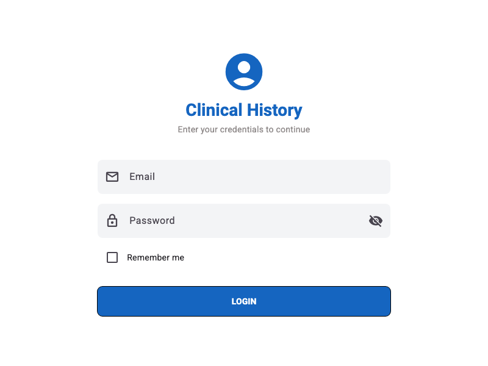

# Clean Architecture SDD Harness

[](https://github.com/Andresit0/architectures/actions/workflows/ci.yml)
[](https://codecov.io/gh/Andresit0/architectures)
[](LICENSE)
[](https://dart.dev)

Feature-first Flutter clean architecture template with Riverpod 3 codegen, a Result-based domain layer, and an AI-assisted SDD/TDD/BDD harness backed by enterprise CI/CD.

## Overview

A production-oriented Flutter starter that enforces clean architecture conventions by design and by CI:

- **Feature-first layout** — each feature owns its domain, infrastructure and presentation layers.
- **Riverpod 3 with codegen** — typed providers, composition root in `lib/app/di/`.
- **Result-based error handling** — `Result<T>` / `AppError` / `guard()` in `lib/shared/error/`; repositories never throw.
- **Package wrapper pattern** — every external package is wrapped (`<name>_wrapper.dart`); features never import packages directly.
- **AI-assisted workflow** — Spec-Local Orchestrator: spec definition, all-tests-first TDD, BDD scenarios, phase gates.
- **Enterprise CI/CD** — analyze, unit/widget, goldens, iOS/Android builds, gitleaks secret scan, codecov, dependabot auto-merge.

## Tech Stack

| Layer | Technology | Version |
|---|---|---|
| Runtime | Flutter / Dart | 3.44.0 / 3.12.0 |
| State management | flutter_riverpod + riverpod_annotation (codegen) | ^3.3.1 / ^4.0.3 |
| Models | freezed + json_serializable | ^3.1.0 / ^6.9.0 |
| Networking | dio | ^5.11.0 |
| Routing | go_router | ^17.2.2 |
| Local storage | sembast (+ sembast_web) | ^3.7.5+2 |
| Secure storage | flutter_secure_storage | ^10.0.0 |
| Auth/crypto | dart_jsonwebtoken, bcrypt, encrypt | ^3.1.1 / ^1.2.0 / ^5.0.3 |
| Device security | flutter_jailbreak_detection_plus | ^1.10.7 |
| Testing | mocktail, golden_toolkit, gherkart (BDD) | ^1.0.4 / ^0.15.0 / ^0.2.1 |

## Screenshots

> Screenshots are generated from the committed golden fixtures (`test/features/auth/presentation/screens/goldens/`).

| Login | Clinical History placeholder |
|---|---|
|  |  |

## Architecture

```
lib/
├── app/            Composition root: providers barrel (_providers.lib.dart), GoRouter, guards, initializer
├── core/           Infrastructure: network (dio wrapper, interceptors, retry), database (sembast), services (auth, crypto, device, storage), config
├── shared/         Domain abstractions: error (Result/AppError/guard), interfaces, models/entities, exceptions, offline-first mixin
├── features/       Feature-first modules: <name>/domain|infrastructure|presentation|di|spec
├── design_system/  Theme + reusable UI
└── l10n/           AppLocalizations (en/es)
```

Dependency rules (enforced by `test/architecture/dependency_rules_test.dart`):

- `domain/` imports only `shared/` — never `core/`, `app/`, or Flutter.
- `core/` is pure infrastructure; domain never depends on it.
- Features never import external packages directly — only wrappers from `core/services/`.

Full details: [MD/APP_ARCHITECTURE.md](MD/APP_ARCHITECTURE.md)

## Repository Structure

- `lib/` — application source. Full tree: [MD/APP_TREE.md](MD/APP_TREE.md)
- `test/` — unit, widget, golden, architecture and BDD tests
- `integration_test/` — device integration tests
- `.ai/` — AI harness (skills, commands, orchestrators). See [AI Harness](#ai-harness)
- `MD/` — reference documentation (architecture, patterns, providers, commands, skills)
- `.github/workflows/` — CI/CD pipelines

## Quickstart

Prerequisites: Flutter 3.44 stable ([install](https://docs.flutter.dev/get-started/install)).

```bash
# 1. Install dependencies
flutter pub get

# 2. Generate localization code (after cloning or modifying .arb files)
flutter gen-l10n

# 3. Generate Riverpod/freezed code (after modifying @riverpod or @freezed files)
dart run build_runner build --delete-conflicting-outputs

# 4. Run the app (macOS example; env vars come from .env — see .env.example)
flutter run -d mac --dart-define-from-file=.env
```

## Testing

| Type | Command | Notes |
|---|---|---|
| Unit / widget | `flutter test` | entities, use cases, mappers, repos, datasources, providers, notifiers |
| Golden | `flutter test --tags golden` | deterministic: embedded fonts + 0.2% tolerance |
| Golden update | `flutter test --tags golden --update-goldens` | run after UI changes; commit PNGs |
| BDD | `flutter test test/bdd` | gherkart scenarios |
| Integration | `flutter test integration_test/auth_integration_test.dart -d macos` | needs device; run files individually (macOS runner caveat); no real HTTP (fakes injected via Riverpod) |
| Analyze | `flutter analyze` | 0 issues required before PR |

Cross-platform behavior (verified in CI):

| Platform | `flutter test` | `flutter test --tags golden` | CI job |
|---|---|---|---|
| macOS (local dev) | ✅ | ✅ (local fonts) | — |
| Linux (CI) | ✅ | ✅ (deterministic) | `Test` / `Test Goldens` |
| Windows (local dev) | ✅ | ✅ | — |

Mocks use `mocktail`; dependencies are replaced via Riverpod overrides — no real network calls in tests.

## CI/CD Gates

Every PR runs `.github/workflows/ci.yml` on `develop` and `main`:

| Job | Purpose |
|---|---|
| Analyze | `flutter analyze`, 0 issues |
| Test | unit/widget + coverage upload to codecov (threshold 1%) |
| Test Goldens | golden tests, cross-platform deterministic |
| Build iOS | `flutter build ios --no-codesign` (macOS runner, CocoaPods cache) |
| Build Android | `flutter build apk --debug` |
| Gitleaks | secret scan gate (fail on leaked credentials) |
| Branch Source Gate | only on PRs to `main` — rejects heads not matching `release/*` or `hotfix/*` |

Dependabot updates are grouped and auto-merged (patch/minor) via [auto-merge.yml](.github/workflows/auto-merge.yml). Coverage configuration: [codecov.yml](codecov.yml).

## Git Flow

```
main ────── TAG vX.Y.Z            production (default branch)
  ▲  PR release/* | hotfix/*  (gate + 7 checks + 1 approval)
develop ──●──●──●                integration (all changes land here)
  ▲
feature/* | dependabot PRs
```

- `develop` — protected: PR required, 6 checks, 0 approvals (dependabot auto-merges patch/minor).
- `main` — protected: PR required, 7 checks (incl. Branch Source Gate), 1 approval; only `release/*` and `hotfix/*` may merge.
- Feature branches are auto-deleted after merge; releases are tagged (`v1.0.0`).
- Releases and hotfixes are back-merged to `develop`.

## AI Harness

This repository is also a working AI development harness:

- **Orchestrator** — [Spec-Local Orchestrator v3](.ai/orchestrators/Spec-Local-Orchestrator.md): spec definition → phase gate → all-tests-first TDD → verification.
- **Skills** — 33 app skills (spec definition, TDD, test writers, fixers, nav-wiring, class-to-solid). Reference: [MD/APP_SKILLS.md](MD/APP_SKILLS.md)
- **Commands** — `super-commit`, `super-md-update`, `spec-local`, `super-pull-request*` in [.ai/commands](.ai/commands/)
- **Agent rules** — [AGENTS.md](AGENTS.md) (repo orientation for AI agents) and [MD/](MD/) reference docs (architecture, barrel pattern, package wrappers, providers, exceptions, dartz, tree).
- **Learning material** — [LEARN.md](LEARN.md)
- **Team rules** — 25 non-negotiable conventions (code, config, barrels, git, quality): [MD/APP_IMPORTANT_INFO.md](MD/APP_IMPORTANT_INFO.md)

## License

MIT — see [LICENSE](LICENSE).
